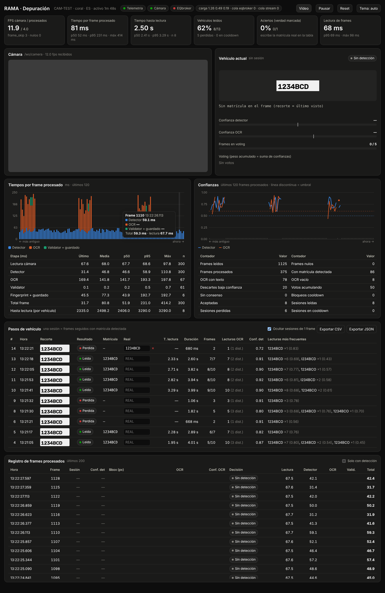

# RAMA · Dashboard de depuración

Dashboard para pruebas de campo con la cámara del parking. Lo sirve el propio
FastAPI de la RPi, no necesita build ni internet:

    http://IP_RPI:8000/debug

(Si abres el HTML desde otro sitio: `debug.html?host=IP_RPI:8000`)

## Ficheros

Copiar sobre el proyecto RAMA respetando las rutas:

| Fichero | Cambio |
|---|---|
| `core/telemetry.py` | **Nuevo.** Recoge tiempos, decisiones y sesiones de vehículo |
| `api/routes/debug.py` | **Nuevo.** `GET /debug`, `GET /api/debug/snapshot`, `POST /api/debug/reset`, `WS /ws/debug` |
| `api/static/debug.html` | **Nuevo.** El dashboard (HTML + JS sin dependencias) |
| `core/pipeline.py` | Mide cada etapa y manda el evento a la telemetría. La lógica de detección no cambia; el fingerprint va en try/except para que no tumbe el pipeline |
| `core/validator.py` | Guarda `last_decision` (motivo + voting). No cambia ninguna decisión |
| `core/detector_yolo.py` | Devuelve también el bbox, como `DetectorCoral` (con `backend: yolo` el pipeline petaba al desempaquetar 3 valores) |
| `api/main.py` | Registra el router `debug` y arranca el broadcaster en el loop de uvicorn |

`main.py` no cambia.

## Qué se mide

Por cada frame procesado (1 de cada `frame_skip`):
`t_read_ms`, `t_detect_ms`, `t_ocr_ms`, `t_validate_ms`, `t_store_ms`, `t_total_ms`,
confianza del detector, bbox y tamaño del recorte, texto y confianza del OCR,
decisión del validator (`baja_confianza`, `acumulando`, `sin_consenso`,
`cooldown`, `aceptada`) con el voting en ese momento, y el recorte en JPG.

**Sesión (paso de vehículo):** frames seguidos con matrícula detectada. Se
cierra con el primer frame sin detección (igual que el reset del validator).
Resultado: `leida`, `perdida` o `cooldown`. Incluye el **tiempo hasta lectura**
(1ª detección → aceptación), los frames necesarios y las lecturas más frecuentes.

En la tabla de sesiones se puede escribir la matrícula real para calcular el %
de aciertos (se guarda en el navegador) y exportar a CSV/JSON.

Sistema: FPS de cámara y de procesado, temperatura de CPU, carga y tamaño de
las colas.
