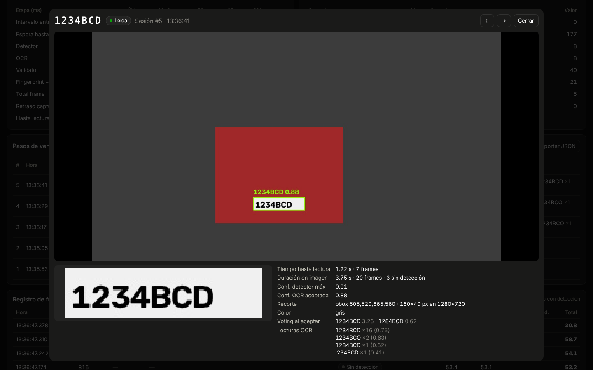

# RAMA · Dashboard de depuración

Dashboard para pruebas de campo con la cámara del parking. Lo sirve el propio
FastAPI de la RPi, no necesita build ni internet:

    http://IP_RPI:8000/debug

(Si abres el HTML desde otro sitio: `debug.html?host=IP_RPI:8000`)


Al pulsar las capturas de un paso de vehículo se abre el visor con la imagen
completa, la matrícula recortada y los datos de la lectura (← → para navegar):



## Ficheros

Copiar sobre el proyecto RAMA respetando las rutas:

| Fichero | Cambio |
|---|---|
| `core/telemetry.py` | **Nuevo.** Tiempos, decisiones, sesiones por vehículo y capturas en disco |
| `core/frame_grabber.py` | **Nuevo.** Hilo que lee la cámara continuamente y guarda solo el último frame |
| `core/roi.py` | **Nuevo.** Zona de detección (polígono) |
| `core/tracker.py` | **Nuevo.** Seguimiento de un único vehículo |
| `core/detector_coral_multi.py` | **Nuevo.** Hereda de tu `DetectorCoral` y añade `detect_all()` (todas las matrículas, con NMS). No toca `detector_coral.py` |
| `api/routes/debug.py` | **Nuevo.** `/debug`, `/ws/debug`, `/api/debug/snapshot`, `/api/debug/captures/{fichero}`, `/api/debug/frame.jpg`, `POST /api/debug/detection-config`, `POST /api/debug/reset` |
| `api/static/debug.html` | **Nuevo.** El dashboard (HTML + JS sin dependencias) |
| `core/pipeline.py` | Último frame (sin `frame_skip`), ROI, seguimiento, OCR con `home_country`, telemetría. **Fingerprint desactivado** |
| `core/validator.py` | Tolera `max_missed_frames`; `finalize()` para decidir al salir; guarda `last_decision` |
| `core/detector_yolo.py` | Devuelve también el bbox; añade `detect_all()` |
| `core/camera.py` | `CAP_PROP_BUFFERSIZE = 1` |
| `core/fingerprint.py` | Corregido pero **sin usar** (lo dejo listo para cuando se active el color) |
| `api/routes/websocket.py`, `api/main.py`, `main.py` | `stream_loop` pasa al loop de uvicorn (antes enviaba desde otro hilo) |

## Configuración nueva (opcional, `settings.yaml`)

Todo tiene valor por defecto; no hace falta tocar el yaml para que funcione.
La ROI y el seguimiento se configuran mejor desde el dashboard: se aplican al
momento y se guardan en `settings.yaml`.

```yaml
detection:
  max_missed_frames: 2      # frames seguidos sin detección antes de dar el vehículo por ido
  roi:
    enabled: false
    polygon: []             # [[x, y], ...] normalizados 0-1; se dibuja en /debug

tracking:
  enabled: false
  skip_ocr_after_read: true # no volver a pasar el OCR a un vehículo ya leído
  decide_on_exit: true      # si se va sin completar el voting, decidir con lo que haya
  min_frames_on_exit: 2     # lecturas mínimas para decidir al salir
  max_jump: 2.0             # desplazamiento máximo entre frames (anchos de matrícula)
  switch_ratio: 1.3         # cambiar a una matrícula X veces más ancha (más cercana); 0 = nunca
  switch_frames: 3          # durante cuántos frames seguidos

stream:                     # solo el vídeo del dashboard, NO afecta a la detección
  width: 320
  height: 180
  fps: 10

debug:
  captures_path: debug_captures   # capturas + sesiones.jsonl
  max_captures: 1000              # ficheros jpg máximos (se borran los más antiguos)
```

## Zona de detección (ROI)

En `/debug` → «Nueva foto», se dibuja el polígono sobre la imagen real (clic
para añadir puntos, arrastrar para moverlos, doble clic para borrar) y
«Guardar y aplicar». El detector solo recibe el rectángulo que contiene la
zona, con lo de fuera en negro:
- Las matrículas fuera (la calle, el carril de al lado) no se detectan.
- La matrícula ocupa más píxeles en la entrada 640×640 de la Coral, así que
  se detecta mejor y desde más lejos.

## Seguimiento del vehículo

Se engancha a la matrícula más grande (el vehículo más cercano) y en los
frames siguientes solo acepta la que sea su continuación (posición y tamaño
coherentes). Las demás se dibujan en naranja y se ignoran hasta que el
vehículo seguido desaparece `max_missed_frames` frames. Mejoras sobre el voting:
- Al empezar un vehículo nuevo se resetea el voting: nunca se mezclan votos
  de dos coches.
- Leído un vehículo, no se le vuelve a pasar el OCR (el OCR es lo más caro).
- Si el vehículo se va antes de completar `frames_for_voting`, se decide con
  las lecturas que haya (mínimo `min_frames_on_exit` y mismo consenso de
  Levenshtein). Aparece como «al salir» en la tabla.
- Si un coche parado o el de detrás se engancha primero y luego entra otro
  claramente más cerca, se cambia a ese.

## Tiempo real

Antes el pipeline leía todos los frames y procesaba 1 de cada 3. Si la
inferencia tardaba más que 3 frames de cámara, OpenCV acumulaba frames del
RTSP y el retraso crecía hasta segundos. Ahora un hilo vacía el stream
continuamente y el pipeline siempre coge el más reciente; los intermedios se
descartan (contador *frames descartados*).

En el dashboard:
- **Retraso real (captura → resultado):** lo que tarda un frame desde que llega
  de la cámara hasta tener la lectura. Se marca en rojo si el p95 pasa de 1 s.
- **FPS cámara:** si es bastante menor que `camera.fps`, la RPi no decodifica el
  RTSP a tiempo (aviso en rojo). Ahí sí compensa bajar la resolución o usar el
  substream de la cámara.

## Qué se guarda de cada vehículo

Una sesión empieza con la primera detección y termina tras más de
`max_missed_frames` frames sin detección. Al cerrarse se guardan en
`debug_captures/`:
- `<fecha>_s<id>_full.jpg`: el frame completo con el bbox y la lectura dibujados.
- `<fecha>_s<id>_crop.jpg`: el recorte que recibió el OCR.
- Una línea en `sesiones.jsonl` con todos los datos (se recarga al reiniciar).

La captura es la del momento en que se aceptó la matrícula. Si no se llegó a
leer, es la del frame con mayor confianza del detector.
